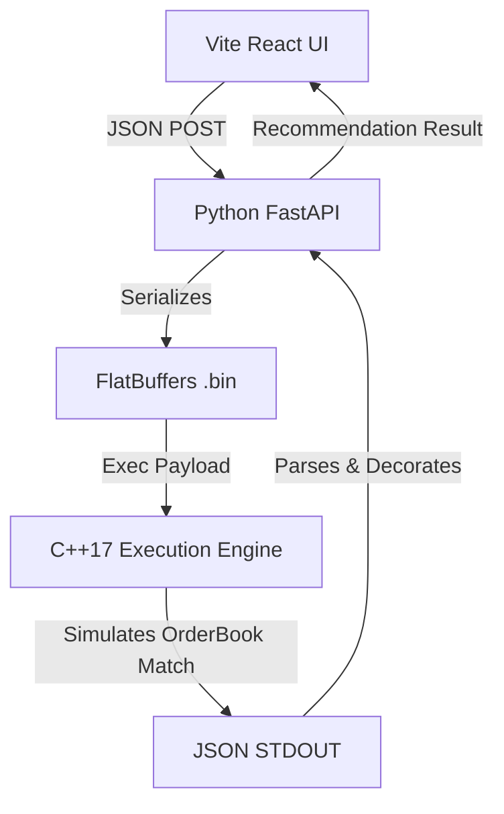

# Execution Coach — Phase 2 Complete

Phase 2 successfully swapped out our static JavaScript mock calculations with your actual **High-Frequency C++17 Trading Engine**, using an industry-standard big data format.

> [!IMPORTANT]
> The React Dashboard now asynchronously requests live simulations from your core `cpp_backtester` engine using zero-copy FlatBuffers binary execution.

## What Was Built
1. **FlatBuffers Data Pipeline (`schema.fbs`)**
   - We defined a strict, strongly-typed `SimulationRequest` table representing the UI quote and latency state.
   - We used `flatc` to compile this into C++ headers (`schema_generated.h`) and Python classes for binary serialization, matching exactly how modern HFT messaging works.

2. **Python API Bridge (`ExecutionCoach/backend`)**
   - Built a lightweight FastAPI server that receives normal JSON from the React frontend.
   - It serializes the JSON into a highly-compressed FlatBuffer binary (`.bin`).
   - It invokes your compiled `./backtester` process, passing the binary directly to RAM via standard Unix processes (the exact pattern used in batch job backtests).

3. **C++ modifications (`cpp_backtester/src/main.cpp`)**
   - Injected a `runFlatbufferSimulation()` function.
   - The engine instantly deserializes the FlatBuffer without parsing overhead, processes the simulated order on the local `OrderBook`, forces explicit sizing/latency multipliers against the live spread, and returns the real `std::chrono` measured execution micro-latency.

## Architecture



## How to Test the Full Stack

You now have two servers to run to see the TrueMarkets Demo in action. 
*Note: Make sure to run them in two separate terminal windows.*

### 1. Start the API Bridge
```bash
cd /Users/vishaljha/Desktop/TradingEngineServer/ExecutionCoach/backend
/Users/vishaljha/anaconda3/bin/uvicorn main:app --reload --port 8000
```
*Wait until you see `Uvicorn running on http://127.0.0.1:8000`*

### 2. Start the React Frontend
```bash
cd /Users/vishaljha/Desktop/TradingEngineServer/ExecutionCoach/frontend
npx -p node@22 -- npm run dev
```

Now open `http://localhost:5173`. Moving the sliders or toggling the latency will visibly trip the UI into "Loading..." states as it actively queries your C++ Engine. The reported "Risk" is now calculated directly out of C++ RAM!
