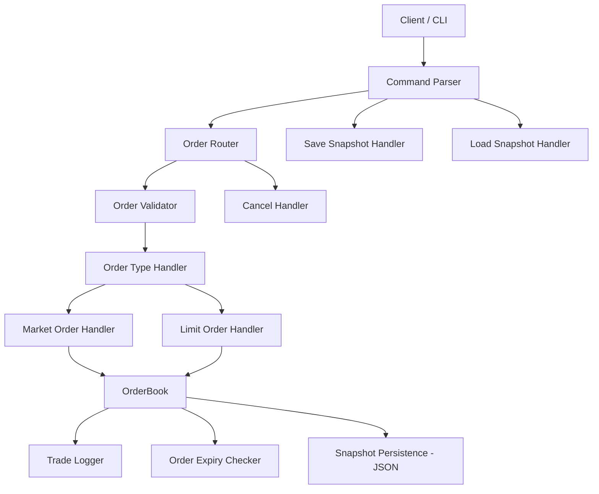

# 🏦 Trading Engine


---

## 🎯 Objective

To build a **high-performance C++ trading engine** capable of managing both **limit and market orders**, maintaining a dynamic **order book**, executing **matching algorithms**, and generating a transparent **trade log**. 

The long-term vision is to evolve this into a full-fledged trading simulator and backtesting platform that supports:
- Multi-instrument matching
- Real-time APIs
- Persistence and recovery
- Quant research and strategy testing

---

## 🚀 Features

### ✅ Core Engine
- Matching engine for limit and market orders (price-time priority).
- Buy/sell order books with deep visibility into price levels.
- Trade logging and event printing.
- Full unit test suite using GoogleTest with 90%+ coverage.

### 🔁 Order Lifecycle Management
- `OrderStatus` enum: `Active`, `Filled`, `Cancelled`, `Expired`
- **Fast O(1) order cancellation** using internal `order_index` for ID-based lookup.
- **Order expiry feature** using optional `expiry_ms` field:
    - TTL or absolute timestamp format.
    - `purge_expired(now_ms)` called before every cycle to clean up stale orders.
    - Expired orders are skipped during matching and can't be cancelled.
- Comprehensive GTests for:
    - Open, partial, filled, missing/duplicate IDs
    - Expiry correctness & edge cases

### 🖥️ Interactive CLI
An easy-to-use command-line interface simulating exchange behavior.

#### 🔧 Supported Commands:
- `add_limit buy|sell <price> <qty> [ttl=N]`
- `add_market buy|sell <qty>`
- `cancel <order_id>`
- `print_depth`
- `print_orders`
- `print_trades`
- `help`, `quit`

#### 🧪 Manual Testing Examples
```bash
add_limit buy 100 10 ttl=2
print_depth        # shows order
# wait ≥2 s
add_limit sell 99 1
print_depth        # buy order auto-removed, only new sell shown
print_trades       # no trades (because order had expired)
```
## 💾 Snapshot Persistence (Milestone #3)

You can now save and load the active order book to/from a file.

### Save snapshot to disk:
```bash
save_snapshot data/book_snapshot.json
```

### Load snapshot from file:
```bash
load_snapshot data/book_snapshot.json
```

Only ACTIVE orders are saved, preserving:
- `id`, `side`, `price`, `quantity`, `timestamp`, and `expiry`.

Snapshots are stored in the `data/` directory. The book is auto-saved on quit.

### Unit Test Coverage
- `OrderBookTest.SaveAndLoadPreservesOrders`
- `OrderBookTest.SnapshotIgnoresInactiveOrders`
- `OrderBookTest.LoadFromInvalidFileThrows`
- `OrderBookTest.LoadFromNonexistentFileThrows`

## 🧠 Project Structure

```
.
├── include/
│   ├── order.hpp              # Order class (Limit & Market)
│   ├── order_book.hpp         # Core matching logic
│   ├── trade.hpp              # Trade struct
├── src/
│   ├── order.cpp
│   ├── order_book.cpp
│   ├── trade.cpp
│   └── main.cpp               # Demo for adding & matching orders
├── test/
│   └── test_order_book.cpp    # Unit tests using GoogleTest
├── CMakeLists.txt
└── README.md
```

---

## 🧪 Engine Logic

### 🧱 Core Concepts

- **Limit Order**: Executes at a specified price or better.
- **Market Order**: Executes immediately at the best available price.
- **Order Expiry (TTL)**: Limit orders can have a time-to-live (TTL) in milliseconds; once expired, they are purged before matching begins.
- **Market Order**: Uses price-time priority to match opposing buy/sell orders; expired orders are skipped during matching.
- **Matching Engine**: Matches opposing buy/sell orders using price-time priority.
- **Trade Log**: Matched orders create a `Trade` object capturing transaction details.
- **Order Lifecycle**: Orders can be Active, Filled, Cancelled, or Expired, tracked internally with fast lookups for cancellation or status updates.

---

## 🗺️ High-Level Architecture


---

## ⚙️ How to Use

### 🏗️ Build and Run

```bash
mkdir build && cd build
cmake ..
make
./TradingEngine
```

### 🧪 Run Tests with Coverage

In **CLion**:
- `Edit Configurations > Add New > Google Test`
- Set the target to `test_order_book`
- Check `With Coverage`
- Click **Run with Coverage**

---

## 📊 Example Output

```
--- Order Book Snapshot ---
Bids:
[100.0] Qty: 10
Asks:
[105.0] Qty: 5

--- Trades Executed ---
TradeID: t1 | Buy: b1 | Sell: s1 | Price: 105.0 | Qty: 5
```

---

## 📚 Supported Order Types

| Type         | Description                                  |
|--------------|----------------------------------------------|
| Market Order | Executes immediately at best available price |
| Limit Order  | Executes only at specified price or better   |

Matching is done using **price-time priority**, and all executed trades are logged using a lightweight `Trade` struct.

---

## ❤️ Contributing

This is a personal learning project — but feedback, suggestions, and PRs are welcome. The eventual goal is to grow this into a fast, clean, modular, and extensible trading core.

---

## 📜 License

MIT License © 2025 Vishal Jha
