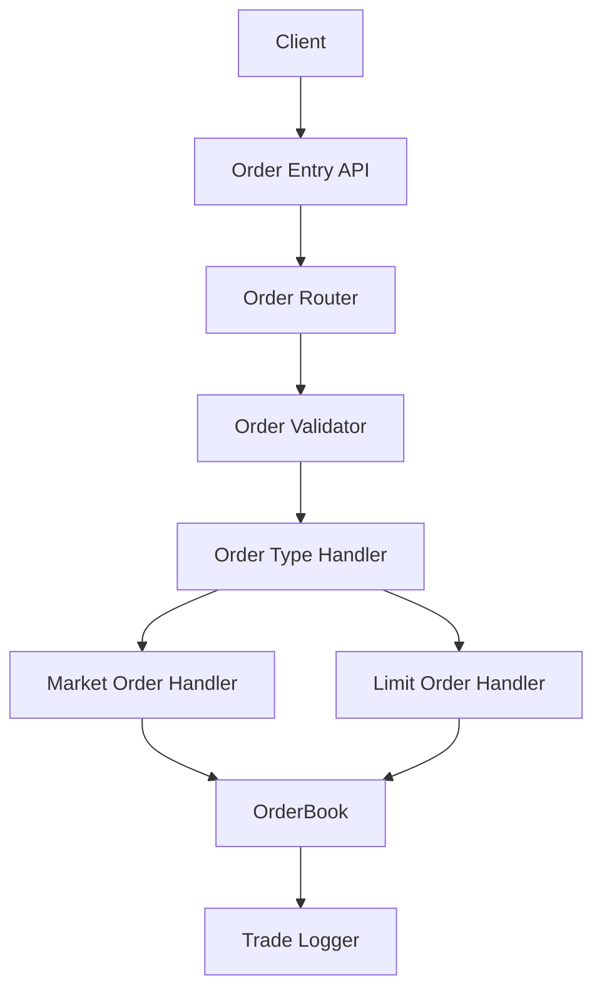

# 🏦 Trading Engine


---

## 🎯 Objective

To build a **high-performance C++ trading engine** capable of managing both **limit and market orders**, maintaining a dynamic **order book**, executing **matching algorithms**, and generating a transparent **trade log**. 

The long-term vision is to evolve this into a full-fledged trading simulator and backtesting platform that supports:
- Multi-instrument matching
- Real-time APIs
- Persistence and recovery
- Quant research and strategy testing

---

## 🧠 Project Structure

```
.
├── include/
│   ├── order.hpp              # Order class (Limit & Market)
│   ├── order_book.hpp         # Core matching logic
│   ├── trade.hpp              # Trade struct
├── src/
│   ├── order.cpp
│   ├── order_book.cpp
│   ├── trade.cpp
│   └── main.cpp               # Demo for adding & matching orders
├── test/
│   └── test_order_book.cpp    # Unit tests using GoogleTest
├── CMakeLists.txt
└── README.md
```

---

## 🧪 Engine Logic

### 🧱 Core Concepts

- **Limit Order**: Executes at a specified price or better.
- **Market Order**: Executes immediately at the best available price.
- **Matching Engine**: Matches opposing buy/sell orders using price-time priority.
- **Trade Log**: Matched orders create a `Trade` object capturing transaction details.

---

## 🗺️ High-Level Architecture



---

## 📍 Milestones

### ✅ Milestone 1: Core Matching Engine
- [x] Support for **Market Orders** and **Limit Orders**
- [x] Matching logic using price-time priority
- [x] Structured **Trade** object with metadata
- [x] Depth snapshot API (bids/asks)
- [x] **Unit test coverage** with GoogleTest
- [x] CLion code coverage integration

### 🔜 Milestone 2: Engine API + Persistence
- [ ] RESTful API for placing, canceling, and querying orders
- [ ] State persistence with SQLite or JSON
- [ ] WebSocket support for trade streaming
- [ ] Engine restart with recovery from persistent storage

---

## ⚙️ How to Use

### 🏗️ Build and Run

```bash
mkdir build && cd build
cmake ..
make
./TradingEngine
```

### 🧪 Run Tests with Coverage

In **CLion**:
- `Edit Configurations > Add New > Google Test`
- Set the target to `test_order_book`
- Check `With Coverage`
- Click **Run with Coverage**

---

## 📊 Example Output

```
--- Order Book Snapshot ---
Bids:
[100.0] Qty: 10
Asks:
[105.0] Qty: 5

--- Trades Executed ---
TradeID: t1 | Buy: b1 | Sell: s1 | Price: 105.0 | Qty: 5
```

---

## 📚 Supported Order Types

| Type         | Description                                  |
|--------------|----------------------------------------------|
| Market Order | Executes immediately at best available price |
| Limit Order  | Executes only at specified price or better   |

Matching is done using **price-time priority**, and all executed trades are logged using a lightweight `Trade` struct.

---

## ❤️ Contributing

This is a personal learning project — but feedback, suggestions, and PRs are welcome. The eventual goal is to grow this into a fast, clean, modular, and extensible trading core.

---

## 📜 License

MIT License © 2025 Vishal Jha
