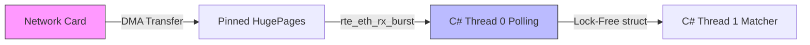

# DPDK / Kernel Bypass Architecture Integration

For true Zero-Allocation High-Frequency Trading, optimizing the application layer (`C# structs`, lock-free `RingBuffers`) is insufficient if the operating system (Linux/macOS) is dropping packets under TCP saturation. 

## The Kernel Bottleneck
Under load, the Linux network stack behaves as follows:
1.  **Hardware NIC** writes incoming packets aggressively to the Ring Buffer.
2.  **Hardware Interrupt (IRQ)** signals the CPU.
3.  **Kernel context switch** transfers packet to `/net/ipv4` stack.
4.  **Application context switch** via `epoll()` or `select()` pulls data from Socket into userspace memory.

This adds >10-15µs per order.

## DPDK Implementation Strategy
In the C# environment, we plan to implement **F-Stack** (a DPDK wrapper) to bypass the Kernel.

### Required Architecture Changes:
1.  **Hardware:** Deploy the TradingEngine exclusively on AWS Elastic Network Adapters (ENA) or Mellanox ConnectX NICs that support hardware queues.
2.  **Uio_Pci_Generic:** Unbind the active NIC from the default Linux driver and bind it to `igb_uio` / `vfio-pci`.
3.  **C# P/Invoke:** Replace the standard Kestrel ASP.NET TCP socket with native `C` interoperability bindings calling the DPDK `rte_eth_rx_burst` polling loop.
4.  **CPU Isolation (`isolcpus`):** Dedicate Cores 0-1 to DPDK polling (100% CPU lock, completely ignoring kernel soft-IRQs), and reserve Cores 2-10 for the actual matching engine execution thread.

### DPDK Data Flow:

