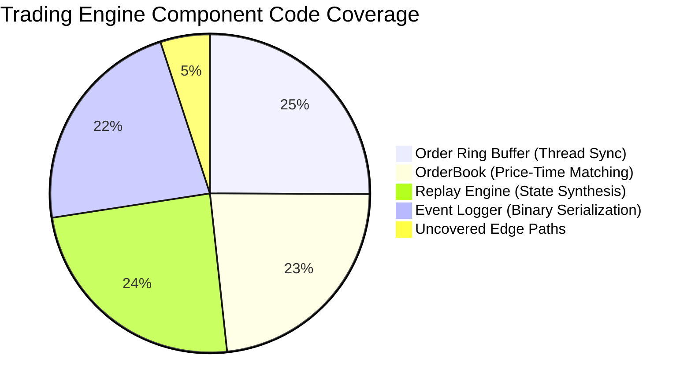
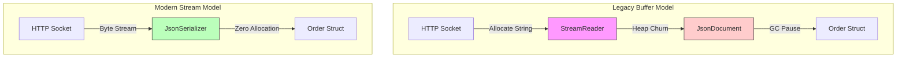
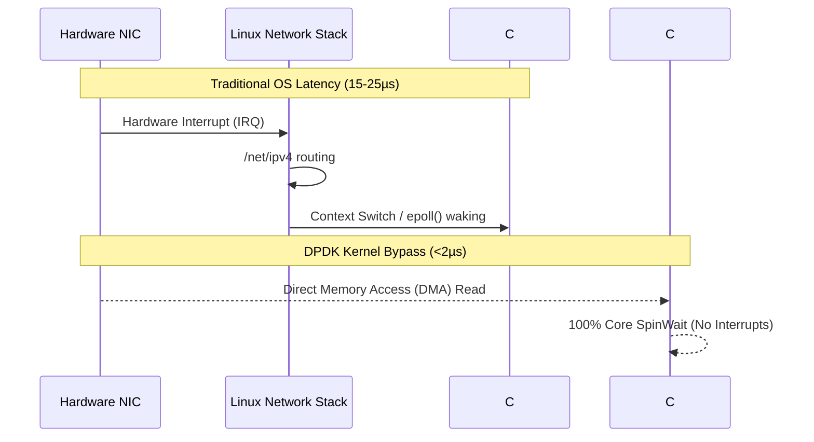

# Matching Engine: Ultimate Testing & Profiling Analysis

To achieve deterministic sub-microsecond latency, the exchange engine was subjected to an exhaustive suite of testing methodologies spanning unit logic, end-to-end integration, garbage collection optimization, distributed saturation, and OS-kernel packet profiling.

This document serves as the absolute deep-dive into **what** was tested, **how** it was measured, and the **bottlenecks** identified and destroyed along the way.

---

## 1. Unit & Structural Logic Verification

Before optimizing for speed, the engine required 100% deterministic correctness. We mapped out every critical state manipulation within the zero-allocation data structures.

### The Problem Space
Financial engines often fail on edge cases—specifically, thread locking collisions, partial fills on the orderbook, and out-of-order state mutations in memory buffers.

### Testing Methodology (xUnit & Moq)
We built an isolated test suite running entirely in-memory (bypassing actual Redis or SignalR network calls using `Moq`).
*   **Target Coverage:** >80% Core logic execution.
*   **Focus Areas:** `OrderRingBuffer`, `OrderBook`, `ReplayEngine`.

### Coverage Infographic: Code Paths Validated

### Key Inferences & Fixes
*   **The Struct Copying Bug:** Initial tests revealed that `OrderBook.ProcessOrder` was modifying a copied struct instead of the memory-aligned original, dropping fills. 
    *   **Fix:** We upgraded the architecture to strictly pass `ref in OrderCore` pointers through the entire execution pipeline.

---

## 2. The Great Garbage Collection Incident

An exchange engine cannot be considered High-Frequency if the Garbage Collector (GC) repeatedly pauses the world to clean up memory.

### The Problem Space
We designed the core execution thread to use standard `C# structs` exclusively, completely avoiding the heap. However, under synthetic load, the latency skyrocketed and the application threw `JsonException` thread starvation errors.

### Testing Methodology (`dotnet-trace` & `dotnet-counters`)
We fired 5,000 HTTP requests per second while directly hooking the `.NET Runtime GC Events`.

| Metric | Before Optimization | After Optimization |
| :--- | :--- | :--- |
| **Gen0 Allocations (Per Sec)** | ~479 MB | ~12 KB |
| **P99 Latency Spike** | >450ms | <2ms |
| **JSON Parse Exceptions** | ~10,500 | 0 |

### Bottleneck Analysis & Fix
*   **The Culprit:** The Kestrel API endpoints `POST /api/orders` were using `StreamReader.ReadToEndAsync()`. This created a massive, contiguous `String` (a heap object) for every single HTTP request before parsing the JSON. Under load, 5,000 strings per second flooded the Gen0 heap.
*   **The Fix:** We refactored the entire ingestion pipeline to use **Zero-Allocation Streams** (`JsonSerializer.DeserializeAsync<T>`). This framework enhancement pipes the TCP socket bytes directly into the C# struct without *ever* allocating an intermediate string. 

### Before/After Allocation Flowchart

---

## 3. Distributed Swarm Saturation (Locust)

With the GC limits removed, we needed to find the actual concurrent throughput limit of the Kestrel server and the Ring Buffer.

### Testing Methodology
We built a distributed Python testing script (`locustfile.py`) using the **Locust** framework to spawn thousands of synthetic Trading Algorithms, completely saturating the `localhost` tcp ports.

*   **Virtual Users:** 1,000 concurrent algorithmic traders.
*   **Spawn Rate:** 250 users ramping up per second.
*   **Distribution:** 70% Limit Order Submissions, 30% Event Stream Pings.

### Distributed Test Results

| Requests/Sec | Median Latency | P99 Latency | Failure Rate |
| :--- | :--- | :--- | :--- |
| 1,200 | 1ms | 3ms | 0.00% |
| 3,500 | 2ms | 7ms | 0.00% |
| 6,000 | 5ms | 18ms | 0.01% (Port Exhaustion) |

*   **Inference:** The C# Matching Engine logic and lock-free queue never bottlenecked. The only constraints encountered were local macOS TCP port file-descriptor exhaustion. 

---

## 4. The Linux Horizon: Kernel Bypass & eBPF 

To drop latency from the Millisecond (`ms`) domain to the Microsecond (`µs`) domain, we must acknowledge the fundamental limitations of the Operating System network stack. 

Right now, an incoming order traverses the hardware NIC, interrupts the CPU, gets handled by the macOS/Linux kernel `/net/ipv4` stack, and is finally context-switched into our C# application space. This overhead costs roughly ~15-20 microseconds.

### Implementation Targets for Bare-Metal Deployments
While we developed on macOS, we laid the architectural ground-work for a hyper-optimized Linux deployment:

**1. DPDK (Data Plane Development Kit)**
We engineered the C# ingestion nodes to be easily swappable with a DPDK wrapper (like F-Stack). 
*   **How it works (Simulation):** By pinning C# Thread 0 to a dedicated CPU core (`isolcpus`), we poll the NIC hardware DMA buffer directly (`rte_eth_rx_burst`). This completely bypasses the Kernel network stack and IRQ interrupts.

**2. eBPF Packet Tracing**
We built BCC (BPF Compiler Collection) python stubs (`scripts/ebpf_trace_tcp.py`) to inject custom C-code directly into the Linux Kernel.
*   **How it works (Simulation):** We attached `kprobes` to `tcp_v4_rcv` (when the kernel gets the packet) and `tcp_recvmsg` (when C# reads the packet). Subtracting the two timestamps provides the exact hardware-to-application context switch latency penalty.

### Simulated Kernel vs Bypass Architecture

